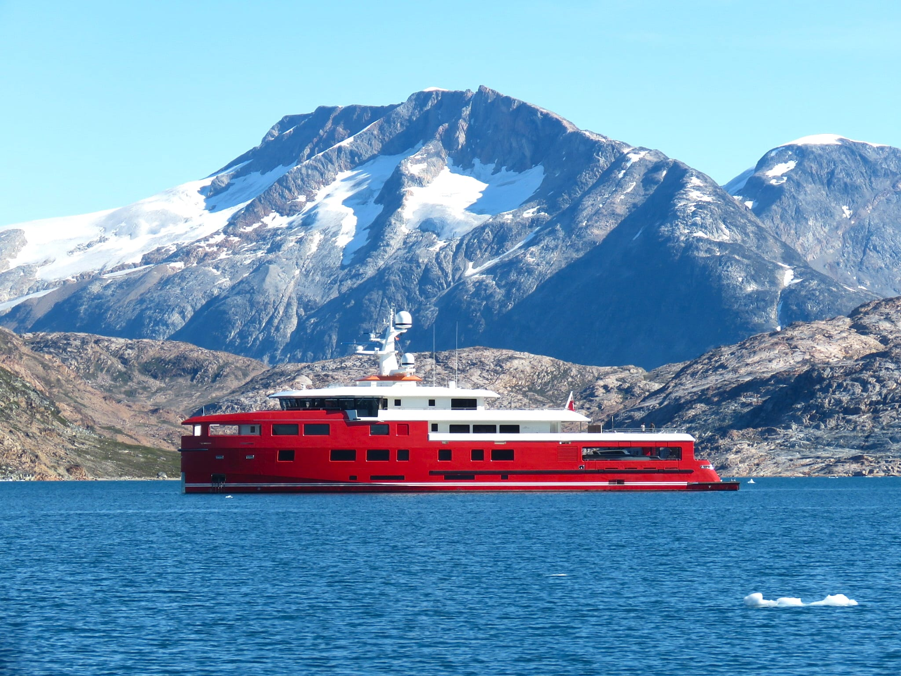
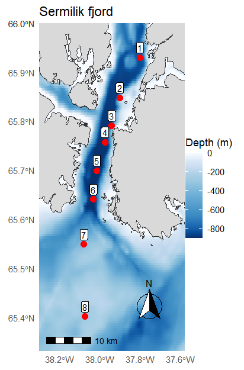
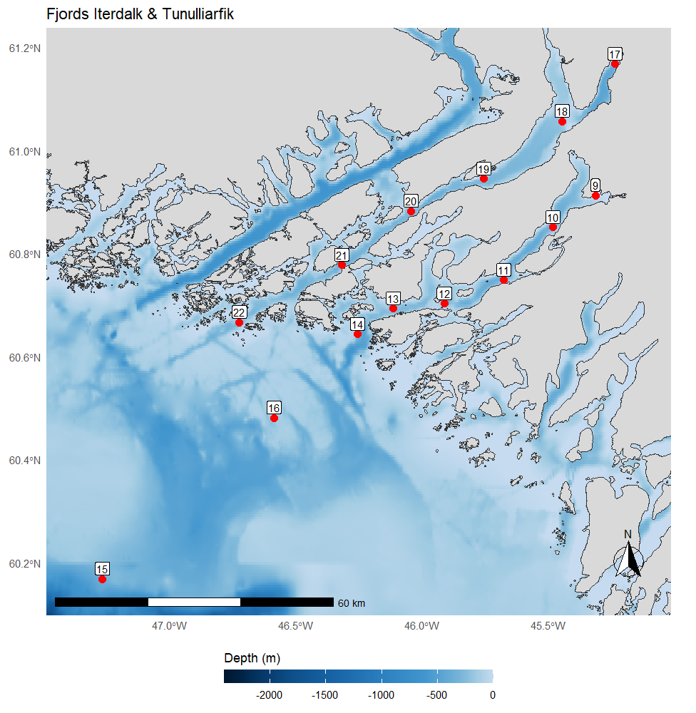

# Introduction

This page presents exploratory interactive networks showing inferred associations between planktonic **prokaryotic** and **eukaryotic** communities across three Greenland fjord systems: **Sermilik**, **Iterdalk**, and **Tunulliarfik**. Samples were collected during the Augmentum / National Oceanography Centre (NOC) Arctic Carbon research cruise aboard the *MY Akula*.

{fig-cap="MY Akula provided by Augmentum" width="50%"}

::: {.columns style="display:flex; gap: 3rem; align-items:flex-start;"}

::: {.column style="flex: 0 0 35%; max-width: 40%;"}
{
  fig-cap="Sermilik Fjord showing sampling stations"
  style="width:100%; height:auto;"
}
:::

::: {.column style="flex: 0 0 65%; max-width: 60%;"}
{
  fig-cap="Fjords Iterdalk and Tunulliarfik with oceanographic stations"
  style="width:100%; height:auto;"
}
:::

:::

The networks were inferred from paired 16S and 18S metabarcoding datasets and aim to explore potential ecological coupling between bacterial and microbial eukaryotic taxa within Arctic fjord ecosystems. The associations shown here do not necessarily represent direct biological interactions, but rather statistical co-occurrence patterns that may reflect shared environmental preferences, bloom dynamics, trophic relationships, or broader ecosystem structuring processes.

For each fjord, a core cross-domain subnetwork is displayed, highlighting the most connected taxa and their inferred associations. Comparing these fjord-specific subnetworks provides an exploratory view of how microbial community organisation may vary among fjord environments with different hydrographic and ecological characteristics.

# How to use the graph

You can interact with the network directly:

- drag nodes to rearrange the layout;
- zoom in and out using the mouse wheel or the navigation buttons;
- click a node to highlight its nearest neighbours;
- use the search box to find a specific taxon;
- larger nodes represent taxa with more network connections;
- colours distinguish prokaryotic and eukaryotic taxa.

# Sermilik fjord network

```{r}
library(tidyverse)
library(SpiecEasi)
library(igraph)
library(visNetwork)
```

```{r}
# Load exported objects
obj <- readRDS("files/network_input_objects.rds")

combined_matrix <- obj$combined_matrix
taxa_names_combined <- obj$taxa_names_combined
tax_all <- obj$tax_all
mat16 <- obj$mat16
mat18 <- obj$mat18
meta <- obj$meta

# Load previously inferred SPIEC-EASI model
se <- readRDS("files/spieceasi_result.rds")

# Rebuild adjacency matrix
adj <- getRefit(se)
rownames(adj) <- taxa_names_combined
colnames(adj) <- taxa_names_combined

# Build global graph
graph <- graph_from_adjacency_matrix(
  adj,
  mode = "undirected",
  diag = FALSE
)

# Label domains
V(graph)$domain <- ifelse(
  grepl("^Bac_", V(graph)$name),
  "Prokarote",
  "Eukaryote"
)

# Add taxonomy labels
tax_labels <- tax_all %>%
  mutate(
    Genus_final = case_when(
      !is.na(Genus) & Genus != "" ~ Genus,
      !is.na(Family) & Family != "" ~ paste0("Unclassified_", Family),
      !is.na(Order) & Order != "" ~ paste0("Unclassified_", Order),
      TRUE ~ "Unclassified"
    ),
    genus_clean = gsub("^Unclassified_", "", Genus_final)
  ) %>%
  dplyr::select(taxon, genus_clean)

node_labels <- tibble(name = V(graph)$name) %>%
  left_join(tax_labels, by = c("name" = "taxon"))

V(graph)$genus_clean <- node_labels$genus_clean

# Keep only cross-domain edges
edge_df <- igraph::as_data_frame(graph, what = "edges")

node_df <- tibble(
  name = V(graph)$name,
  domain = V(graph)$domain
)

edge_df2 <- edge_df %>%
  left_join(node_df, by = c("from" = "name")) %>%
  rename(domain_from = domain) %>%
  left_join(node_df, by = c("to" = "name")) %>%
  rename(domain_to = domain)

cross_edges <- edge_df2 %>%
  filter(domain_from != domain_to)

cross_nodes <- unique(c(cross_edges$from, cross_edges$to))

graph_cross <- induced_subgraph(graph, vids = cross_nodes)
graph_cross <- delete_vertices(graph_cross, degree(graph_cross) == 0)
```

```{r}
make_fjord_network <- function(fjord_name,
                               graph_obj = graph_cross,
                               meta_df = meta,
                               mat16_in = mat16,
                               mat18_in = mat18,
                               degree_threshold = 7,
                               min_taxon_sum = 1) {
  
  samp <- meta_df$Sample[meta_df$Fjord == fjord_name]
  
  bac_present <- rownames(mat16_in)[
    rowSums(mat16_in[, samp, drop = FALSE]) >= min_taxon_sum
  ]
  
  euk_present <- rownames(mat18_in)[
    rowSums(mat18_in[, samp, drop = FALSE]) >= min_taxon_sum
  ]
  
  taxa_present <- unique(c(bac_present, euk_present))
  taxa_present <- intersect(taxa_present, V(graph_obj)$name)
  
  g_fjord <- induced_subgraph(graph_obj, vids = taxa_present)
  g_fjord <- delete_vertices(g_fjord, degree(g_fjord) == 0)
  
  if (vcount(g_fjord) == 0) {
    stop("No network nodes found for this fjord.")
  }
  
  deg_fjord <- degree(g_fjord)
  keep_nodes <- names(deg_fjord[deg_fjord > degree_threshold])
  
  g_core <- induced_subgraph(g_fjord, vids = keep_nodes)
  g_core <- delete_vertices(g_core, degree(g_core) == 0)
  
  if (vcount(g_core) == 0) {
    stop("No nodes remained after degree filtering.")
  }
  
  nodes <- data.frame(
    id = V(g_core)$name,
    label = ifelse(
      !is.na(V(g_core)$genus_clean) & V(g_core)$genus_clean != "",
      V(g_core)$genus_clean,
      V(g_core)$name
    ),
    title = paste0(
      "<b>", V(g_core)$name, "</b><br>",
      "Domain: ", V(g_core)$domain, "<br>",
      "Degree: ", degree(g_core)
    ),
    group = V(g_core)$domain,
    value = degree(g_core),
    stringsAsFactors = FALSE
  )
  
  edges <- igraph::as_data_frame(g_core, what = "edges") %>%
    transmute(from = from, to = to)
  
visNetwork(nodes, edges, height = "850px", width = "100%") %>%
  
  visGroups(
    groupname = "Bacteria",
    color = list(
      background = "#2C7FB8",
      border = "#1D4E89",
      highlight = "#4FA3E3"
    )
  ) %>%
  
  visGroups(
    groupname = "Eukaryote",
    color = list(
      background = "#D95F0E",
      border = "#A63D07",
      highlight = "#F28E2B"
    )
  ) %>%
  
  visNodes(
    borderWidth = 1,
    scaling = list(min = 10, max = 35),
    font = list(size = 18)
  ) %>%
  
  visEdges(
    color = list(color = "grey70", highlight = "black"),
    smooth = FALSE
  ) %>%
  
  visOptions(
    highlightNearest = list(enabled = TRUE, degree = 1, hover = TRUE),
    nodesIdSelection = TRUE
  ) %>%
  
  visInteraction(
    navigationButtons = TRUE,
    zoomView = TRUE,
    dragNodes = TRUE,
    dragView = TRUE
  ) %>%
  
  visPhysics(
    solver = "forceAtlas2Based",
    stabilization = TRUE
  ) %>%
  
  visLayout(randomSeed = 7) %>%
  
  visLegend()
}
```

```{r}
make_fjord_network("Sermilik", degree_threshold = 7)
```

# Iterdalk fjord network

```{r}
make_fjord_network("Iterdalk", degree_threshold = 7)
```

# Tunulliarfik fjord network

```{r}
make_fjord_network("Tunulliarfik", degree_threshold = 7)
```

# Interpretation

The fjord-specific cross-domain networks reveal structured associations between planktonic prokaryotic and eukaryotic communities across the Greenland fjord systems. In all three fjords, prokarotic and eukaryotic taxa form interconnected networks rather than separate clusters, suggesting ecological coupling within the microbial plankton community.

Across the networks, several prokarotic taxa occupy central and highly connected positions, acting as potential ecological hubs linking multiple eukaryotic groups. Many of these taxa belong to common marine heterotrophic or particle-associated bacterial lineages frequently associated with phytoplankton-derived organic matter and bloom dynamics. Eukaryotic taxa are distributed throughout the networks and are often connected through shared bacterial hubs.

One particularly notable feature is the recurrent prominence of *Candidatus Nitrosopumilus*, which appears as one of the largest and most highly connected nodes across all fjord networks. Members of this **archaeal lineage** are widespread **marine ammonia oxidisers** and play a major role in the nitrogen cycle by converting ammonia into nitrite. Their central position within the networks suggests that nitrifying archaea may represent important ecological connectors within Greenland fjord microbial communities. The repeated association of *Candidatus Nitrosopumilus* with diverse taxa may reflect coupling between nitrogen cycling processes, primary production, and organic matter remineralisation within these fjord ecosystems.

The overall structure of the networks is moderately modular, with smaller subnetworks interconnected through highly connected taxa. Such organisation is consistent with complex microbial ecosystems in which multiple ecological niches remain linked through broader community-scale interactions. The repeated appearance of highly connected bacterial connector taxa across fjords suggests that prokaryotic communities may play an important integrative role in structuring Greenland microbial food webs and mediating carbon cycling processes.

Although each fjord displays its own network topology and dominant taxa, the overall organisation remains remarkably consistent, supporting the idea that cross-domain microbial coupling is a general feature of these Greenland fjord ecosystems.

